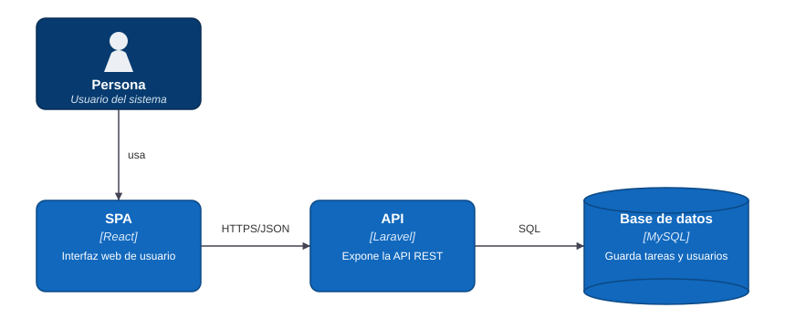
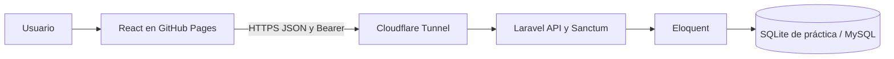

# TaskFlow — Backend

API REST de tareas de Edgar Punina. Cada cuenta administra sus propias tareas con registro, login, cierre de sesión y CRUD protegido por Laravel Sanctum.

- Repositorio: https://github.com/EdgarPunina/Proyecto-Laravel-inicial-de-TaskFlow
- API pública temporal de la sesión 07: https://acquisition-tahoe-sequence-discrimination.trycloudflare.com/api
- Frontend en GitHub Pages: https://edgarpunina.github.io/taskflow-frontend/
- CI: https://github.com/EdgarPunina/Proyecto-Laravel-inicial-de-TaskFlow/actions/workflows/tests.yml

El frontend está publicado en GitHub Pages. Su repositorio se hizo público con autorización de Edgar Punina. La API utiliza el túnel temporal descrito abajo.

## Stack y ejecución local

Laravel 10, PHP 8.1 o superior (CI en 8.2), Eloquent, Sanctum 3 y PHPUnit 10. MySQL es la configuración original; la demostración utiliza SQLite persistente y los tests SQLite en memoria.

Desde la raíz de este repositorio, con PHP, Composer y las extensiones mbstring, OpenSSL y pdo_sqlite disponibles:

```powershell
composer install
Copy-Item .env.example .env
php artisan key:generate
powershell -NoProfile -ExecutionPolicy Bypass -File .\scripts\serve-sqlite.ps1
```

Copia el archivo de entorno solo durante la primera instalación. El script migra, crea datos de demostración y sirve en http://127.0.0.1:8000. La base local es database/practice.sqlite y no se versiona. Para MySQL configura DB_* en .env, inicia MySQL, ejecuta php artisan migrate y php artisan serve.

## Arquitectura





Las rutas delegan en AuthController y TaskController. Los controladores validan la entrada y consultan la relación tasks del usuario autenticado; TaskResource limita la respuesta a los campos públicos. Consulta [las decisiones de arquitectura](ARQUITECTURA.md).

## Patrones de diseño

**Observer (GoF):** app/Observers/TaskObserver.php observa las actualizaciones de Task; si cambia status registra el estado anterior y el nuevo. AppServiceProvider registra el observador con Task::observe. Esto desacopla la notificación de los controladores. Los tests comprueban que cambiar otro campo no notifica un cambio de estado.

**Factory de Eloquent:** database/factories/TaskFactory.php centraliza los datos de prueba y crea un propietario con User::factory(). Es la herramienta de creación de fixtures del framework; el patrón GoF explícito aplicado en el dominio es Observer.

## Endpoints

| Método | Ruta | Uso |
|---|---|---|
| POST | /api/register, /api/login | Registro y emisión de token |
| GET | /api/user | Usuario autenticado |
| POST | /api/logout | Revocar el token actual |
| GET, POST | /api/tasks | Listar tareas propias / crear |
| GET, PATCH, PUT, DELETE | /api/tasks/{id} | Detalle / edición / eliminación |

Salvo registro y login, requieren Authorization: Bearer y Accept: application/json. Sin token: 401; tarea ajena o inexistente: 404; datos inválidos: 422. La configuración CORS existente admite api/* y el uso de Bearer entre orígenes.

## Exponer la API con Cloudflare

En una terminal:

```powershell
powershell -NoProfile -ExecutionPolicy Bypass -File .\scripts\serve-public.ps1
```

En otra, instala cloudflared desde su distribución oficial o usa el ejecutable portátil descargado en la carpeta hermana .tools:

```powershell
..\.tools\cloudflared.exe tunnel --url http://127.0.0.1:8001 --no-autoupdate
```

El puerto 8001 permite conservar el servidor local del puerto 8000. El script desactiva APP_DEBUG y sirve la base SQLite de práctica. Copia la URL HTTPS impresa por cloudflared y añade /api; actualiza VITE_API_URL en el frontend y en Settings → Secrets and variables → Actions → Variables. Después vuelve a ejecutar el workflow de Pages: la variable se incorpora al compilar.

**Disponibilidad:** el túnel es temporal. La API funciona mientras este equipo permanezca encendido y ambos procesos activos. Al reiniciar el túnel cambia su URL. GitHub Pages conserva los archivos del frontend, pero no mantiene encendido Laravel. Para una revisión posterior hay que reabrir el túnel y actualizar el despliegue, o contratar/configurar alojamiento persistente por separado.

## Pruebas y CI

```powershell
php artisan test
```

23 pruebas y 110 aserciones verifican autenticación, aislamiento por usuario, CRUD, validación, Resource y Observer. .github/workflows/tests.yml instala PHP 8.2 y dependencias, genera una clave nueva y ejecuta la suite en cada push a main, pull request o ejecución manual. phpunit.xml fuerza SQLite en memoria: no requiere MySQL ni credenciales externas.

No se versionan .env, vendor, bases SQLite ni credenciales. Las guías [sesión 04](SESION-04.md) y [sesión 05](SESION-05.md) conservan la evidencia anterior.
